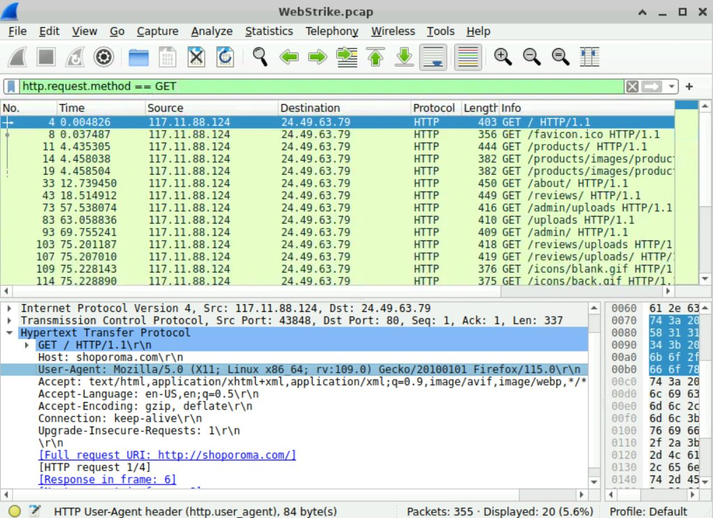

# 🐚 Web Attack Analysis

## 1. Threat Actor Profile
* **Origin:** Tianjin, China (Identified via Geo-IP Lookup).
* **Attacker IP:** `117.11.88.124`
* **User-Agent:** `Mozilla/5.0 (X11; Linux x86_64; rv:109.0) Gecko/20100101 Firefox/115.0`

## 2. Exploitation Details
Penyerang berhasil mengunggah file berbahaya dengan metode **Double Extension Bypass**.
* **Malicious File:** `image.jpg.php`
* **Upload Path:** `/uploads/`
* **HTTP Method:** `POST`

