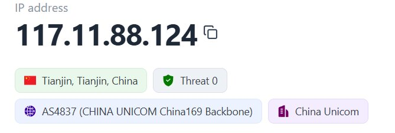
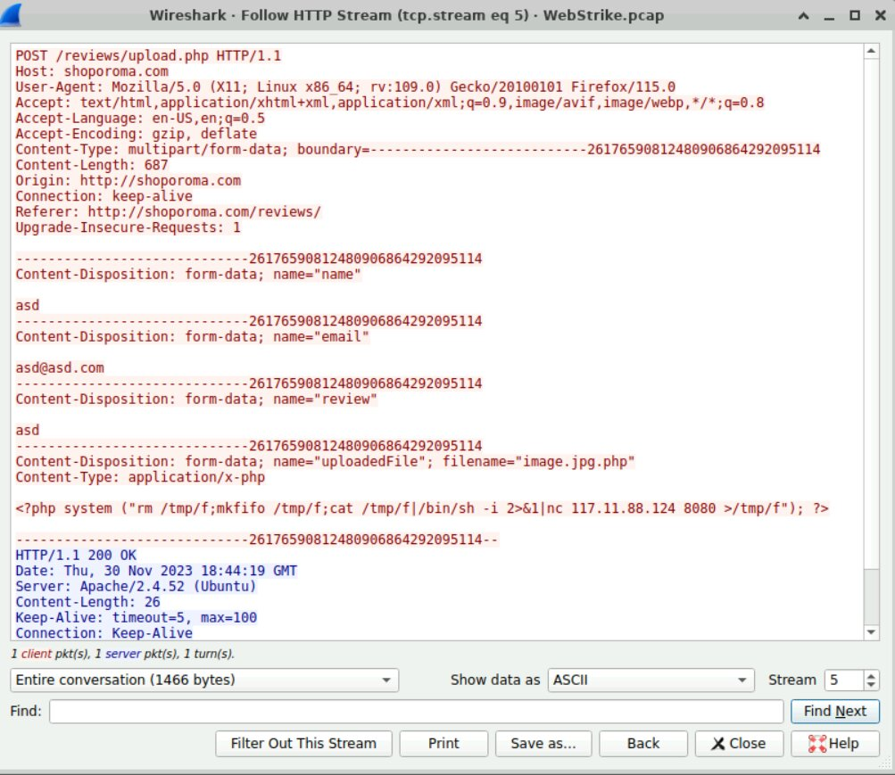
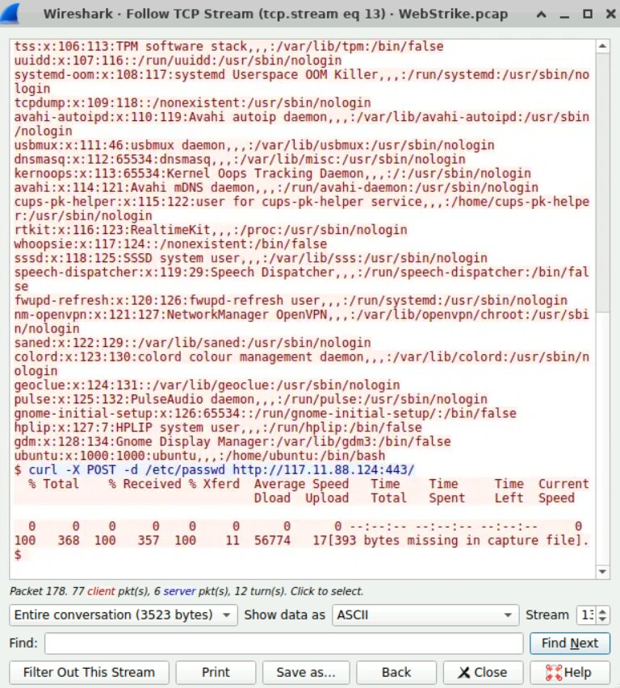

# 🔍 Wireshark Filters — WebStrike Investigation

Kumpulan display filter yang digunakan selama investigasi insiden WebStrike.
Semua filter dapat langsung di-copy ke kolom filter bar Wireshark.

---

## 1. Reconnaissance — Identifikasi Traffic Penyerang

**Tujuan:** Melihat seluruh traffic yang berasal dari IP penyerang.
http.request.method == GET

**Hasil:** Teridentifikasi aktivitas scanning dan HTTP request mencurigakan
dari IP `117.11.88.124` (Tianjin, China).

---

## 2. Exploitation — Deteksi Upload Webshell

**Tujuan:** Melihat semua HTTP POST request untuk mendeteksi aktivitas upload file.
http.request.method == "POST"

**Hasil:** Ditemukan upload file `image.jpg.php` ke direktori `/uploads/`
menggunakan metode Double Extension Bypass.

---

## 3. Command & Control — Deteksi Reverse Shell

**Tujuan:** Memantau koneksi outbound mencurigakan ke port 8080.
http.request.method == POST, Right-click on the selected packet and select Follow > HTTP Stream to view the conversation.

**Hasil:** Server korban (`24.49.63.79`) membuka koneksi balik ke mesin
penyerang pada port 8080 — indikasi kuat adanya Reverse Shell aktif.

---

## 4. Exfiltration — Deteksi Pencurian Data

**Tujuan:** Mencari indikasi akses atau pengiriman file sensitif `/etc/passwd`.
http contains "passwd"
http.request.uri contains "image.jpg.php"

**Hasil:** Terdeteksi perintah `curl -X POST` yang mencoba mengirimkan
isi file `/etc/passwd` keluar dari jaringan.

---

## 5. Follow TCP Stream — Melihat Perintah Penyerang

**Tujuan:** Melihat secara lengkap apa yang diketik penyerang di terminal
setelah Reverse Shell berhasil dibuka.

**Cara:**
1. Klik kanan pada paket dengan port 8080
2. Pilih **Follow → TCP Stream**
3. Wireshark akan menampilkan seluruh sesi terminal penyerang

**Hasil:** Terlihat perintah yang dijalankan penyerang secara real-time,
termasuk perintah `curl` untuk exfiltration data.

---

## 📋 Quick Reference

| Fase | Filter |
| :--- | :--- |
| Semua traffic penyerang | `ip.src == 117.11.88.124` |
| HTTP POST (upload) | `http.request.method == "POST"` |
| Reverse Shell | `tcp.port == 8080` |
| Exfiltration | `http contains "passwd"` |
| Traffic server korban | `ip.addr == 24.49.63.79` |

---

[⬅️ Kembali ke Web Attack Analysis](./Web-Attack-Analysis.md)
