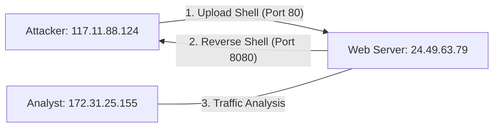

# Lab Setup & Capture Strategy

Dokumentasi ringkas mengenai infrastruktur dan metode pengambilan bukti serangan.

---

## 1. Network Topology
Diagram alur serangan dan posisi mesin analisis dalam lab:

## 2. Capture Strategy
Metodologi pengumpulan bukti digital:

* **Monitoring Point:** Interface `eth0` pada Web Server (`24.49.63.79`).
* **Target Traffic:** * **Port 80 (HTTP):** Identifikasi payload upload Web Shell (`image.jpg.php`).
    * **Port 8080 (TCP):** Deteksi koneksi *outbound* (Reverse Shell).
* **Format Evidence:** PCAP (Packet Capture) untuk menjaga validitas *timestamp* dan IP asal.

---

## 3. Tools & Network Details
Data teknis infrastruktur lab:

* **Tools:** `Wireshark` (Analysis)
* **Network Config:**
    * **Subnet:** 24.49.63.0/24
    * **Gateway:** 24.49.63.1
    * **Subnet Mask:** 255.255.255.0

---
[⬅️ Kembali ke README Utama](../README.md)
